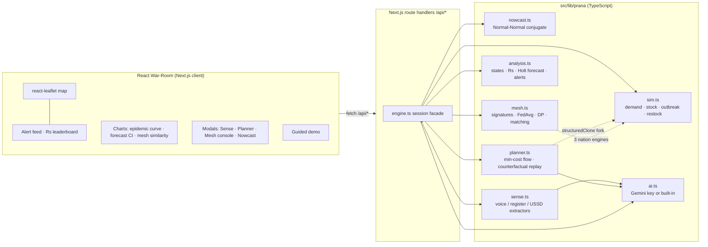

# PRANA — Predictive Resource Allocation & Networked Adaptation

A hackathon demo of a **federated AI platform for national health supply-chain resilience**, presented as a dark "war-room" command centre for the fictional region *Demo Pradesh* (12 districts, 60 PHCs, 8 tracked medicines).

| Pillar | Module | What it shows |
|---|---|---|
| 1 | **PRANA-Sense** | Stock inferred from weak signals — Hinglish voice notes, photographed paper registers, USSD — fused by a Bayesian nowcast that *always* shows a confidence band |
| 2 | **PRANA-Cortex** | Shortages as a **contagion** over the referral graph, with a Shortage Reproduction Number **Rs** per district–medicine pair; alerts fire at Rs > 1 |
| 3 | **PRANA-Planner** | Min-cost-flow plans (BALANCED / FASTEST / CHEAPEST), counterfactual replay, plain-language rationale, one-click human approval |
| 4 | **PRANA-Mesh** | Simulated federated Crisis Pattern Library across IND / BRA / ZAF — nations share 12-number signatures, never data — enabling early, zero-shot forecasts |

> **Platform note.** The original brief asked for FastAPI + Vite. This build targets the Next.js runtime the sandbox provides, so the *entire* engine (simulation, nowcast, contagion, min-cost-flow optimiser, federated mesh) is **TypeScript running in Next.js route handlers**; the UI is React + `react-leaflet`. All behavioural requirements are kept: no database (in-memory state + JSON seeds), no Docker, **fully offline** (no tiles, no external fonts), deterministic seed 42, and pluggable AI (`OPENAI_API_KEY` → OpenAI, otherwise deterministic mocks with identical JSON schemas and a **MOCK-MODE** badge). Same-origin `/api/*` means zero CORS. The PIL register-image generator is real Python (`scripts/generate_registers.py`).

## Architecture



## Deploying to Vercel

The app has **no database** — all simulation state lives in server memory — so Vercel works with just the repo and one environment variable.

1. **Push the repo to GitHub** (the `.env` file is git-ignored; only `.env.example` ships):
   ```bash
   git init && git add -A && git commit -m "Prana"
   git remote add origin git@github.com:<you>/prana.git
   git push -u origin main
   ```
2. **Import it:** vercel.com → *Add New → Project* → pick the repo. Vercel auto-detects Next.js; leave the defaults (`npm run build`, output `.next`).
3. **Set the key:** project *Settings → Environment Variables* → add `GEMINI_API_KEY` (optionally `GEMINI_MODEL`) for *Production, Preview and Development*. It is read only by server-side route handlers and never reaches the browser.
4. **Deploy.** Open the URL. First request seeds the 90-day history (~1 s).

### Things to know about Vercel

| Topic | What happens |
|---|---|
| Function timeout | Route handlers request a 30 s max duration, which the Hobby plan allows. Long Gemini vision calls usually fit well inside it. |
| **State** | The simulation is in memory. Vercel keeps an instance warm while you use the app, so a live demo runs smoothly — but after a long idle period a cold start **resets the demo to day 0** (it re-seeds automatically and the UI recovers; just press ▶ Play again). This is fine for a single-operator hackathon demo. If you need the world to survive across visits, move the world state into Postgres (Neon) or Redis (Upstash) behind the existing `engine.ts` session facade. |
| AI | Works exactly as locally; test it from **Ask Prana → Test Gemini** after deploy. |
| Build | ~30 s on Vercel, no extra config, no native modules. |

## Setup — 2 commands

```bash
npm install          # (1) install
GEMINI_API_KEY=... npm run dev     # (2) run  → http://localhost:3000   (or: npm run build && npm start)
```

### AI (Gemini)

Set the key and Prana reads notes and photos, writes plan explanations, and answers questions:

```bash
export GEMINI_API_KEY=your-key        # GOOGLE_API_KEY also works
export GEMINI_MODEL=gemini-2.5-flash  # optional pin; normally leave it unset
```

**Model names change often** (Gemini 2.0 Flash is shut down; 3.x is current), so Prana does not rely on a fixed name. It asks Google's `ListModels` which models *your key* can use, ranks them (known-good free-tier Flash / Flash-Lite first, TTS / image / embedding / Pro excluded or demoted), and tries them in order. It moves to the next model on 404 (not available), 429 (that model's free quota) and 503 (overloaded), and stops immediately on a bad key. The winner is remembered.

If something is wrong, open **Ask Prana → Test Gemini** (or click the badge in the header). It shows the models your key can use, what was tried and why each failed, and lets you pin one with a click.

| Where AI is used | What it does | Without a key |
|---|---|---|
| Voice notes | Transcribes audio, extracts the stock facts | Built-in keyword reader (same JSON) |
| Register photos | Reads the table rows and their positions | Pre-baked read of the sample register |
| Action plans | Writes the 3-sentence explanation | Templated explanation (same slot) |
| **Ask Prana** | Answers questions using only today’s numbers | Built-in answerer, clearly labelled |
| Daily briefing | Writes the 3 bullets on the home page | Built-in summary |

Free-tier limits are per model and change over time; rate-limit and model errors are shown in the UI and everything keeps working on the built-in readers. Thinking models spend output tokens on reasoning, so calls request a generous output budget and ignore the reasoning text.

Tests: `npx tsx --test tests/prana.test.ts tests/ai.test.ts` (the AI test runs against a mock Gemini server) — nowcast conjugate math, Rs sign conventions, optimizer feasibility (no negative stock, cold-chain), counterfactual deltas non-zero during the surge, FedAvg on toy vectors, determinism.

## The 3-minute demo script

Walk through the pages in this order. Everything below is one click away in the interface.

| Time | Step | Say |
|---|---|---|
| 0:00 | **1 · Look around** | "12 districts, 60 clinics. Marker size is stock health; *opacity is how well we can actually see it* — faded means stale data." |
| 0:30 | **2 · Weak signals** | "No computers needed. Paste a voice note or upload a photo of the register — Gemini reads it and the estimate range tightens." Show the before/after range bars. "We never show a bare number." |
| 1:00 | **3 · Inject surge (day 5)** | "Dengue starts in D4 and spreads along referral edges." Red nodes flash, edges pulse. |
| 1:30 | **4 · Day ~9: Rs > 1 → CRITICAL** | "Stock-outs spread like a pathogen. D4 Paracetamol has Rs = 1.19 — each stocked-out district now infects more than one neighbour." Alert feed + leaderboard light up. |
| 2:00 | **5 · Planner** | "Three plans, each replayed 21 days with and without. Balanced: Rs falls, thousands of untreated patient-days avoided." Approve BALANCED → shipment arcs; *the two epidemic curves diverge*. |
| 2:30 | **6 · Country Network** | "Brazil shared a 12-number fingerprint — no data. We match it at ~90% and forecast the ramp days early." Toggle **with / without the network**. |

Timeline of the seeded scenario: injection day 5 → first watch alert ≈ day 9 → **urgent on day 9** → country-network match ≥ 85% ≈ day 8–10.

## Judging-criteria mapping

| Criterion | Where PRANA delivers |
|---|---|
| Innovation | Shortages modelled as contagion; a computed **Rs** for supply chains; federated pattern library with zero-shot forecasts |
| Technical depth | Conjugate Bayesian nowcast, deterministic simulator, Holt forecasting, min-cost max-flow with cold-chain constraints, what-if replay by state forking, FedAvg + Laplace noise (`docs/MODEL.md`), Gemini extraction / vision / grounded Q&A |
| Real-world feasibility | Works from voice/paper/USSD; honest CIs and an Observability score; human-in-the-loop approval; nothing needs cloud or API keys |
| Impact | "Untreated patient-days avoided", epidemic curve with vs without intervention, ~6-day early-warning head start |
| Privacy / ethics | Only 12-d signatures leave a nation; optional ε=4 differential privacy; explicit uncertainty |
| UX | Seven clear pages, plain English, loading states, one-click **Start over**, honest “no AI key” badge, deterministic replay |

## API (all under `/api`, JSON)

`GET state · meta · ai/test · sense/voice-notes · sense/registers · nowcast?phc=&med= · forecast?d=&m= · mesh · planner · ai/briefing` — `POST ai/model{model} · tick{n} · reset · inject · sense/voice (text or audio upload) · sense/register (id or photo upload) · sense/manual · planner/run · planner/approve{name} · planner/reject · mesh/round{dp} · ai/ask` — plus `GET /api/health`.

## Pages

| Page | URL | What it is |
|---|---|---|
| Home | `/` | Plain-English story, live numbers, glossary of every term |
| Live Map | `/map` | District map coloured by spread score, clinics, alerts, top risks, trucks |
| Stock Check | `/stock` | Voice notes, register photos, typed counts, per-clinic stock estimate with likely range |
| Shortage Spread | `/spread` | Spread-score grid (every district × medicine), alerts, clinics-out curve, demand forecast |
| Action Plans | `/plan` | Three plans, what-if replay, approve / reject |
| Country Network | `/countries` | Shared fingerprints, with vs. without network forecast, privacy toggle |
| Ask Prana | `/ask` | Ask questions in plain English; answers are grounded in today’s numbers |

The simulation lives on the server, so the clock, outbreak and approvals carry across pages. A floating bar at the bottom controls time on every page.

### Plain-English glossary (old name → what the UI says)

Shortage Reproduction Number Rs → **spread score** · confidence interval → **likely range** · observability score → **how well we see it** · counterfactual replay → **what-if replay** · federated signature → **fingerprint** · cosine similarity → **% similar** · differential privacy → **extra privacy (adds noise)** · CRITICAL / WARNING → **Urgent / Watch**.

## Layout

```
src/app/         page.tsx (home) · map · stock · spread · plan · countries · ask · api/[...path]/route.ts
src/lib/prana/   core · world · sim · analysis · nowcast · sense · ai (Gemini) · planner · mesh · engine
src/components/  Shell (nav + time bar + tour caption) · SimContext (shared state) · MapView · Charts · ui
src/data/        voice_notes.json · registers.json (generated with PIL)
scripts/         generate_registers.py (Pillow) · tune.ts · plan.ts · mesh.ts
tests/           prana.test.ts
docs/MODEL.md    every formula and assumption
```
